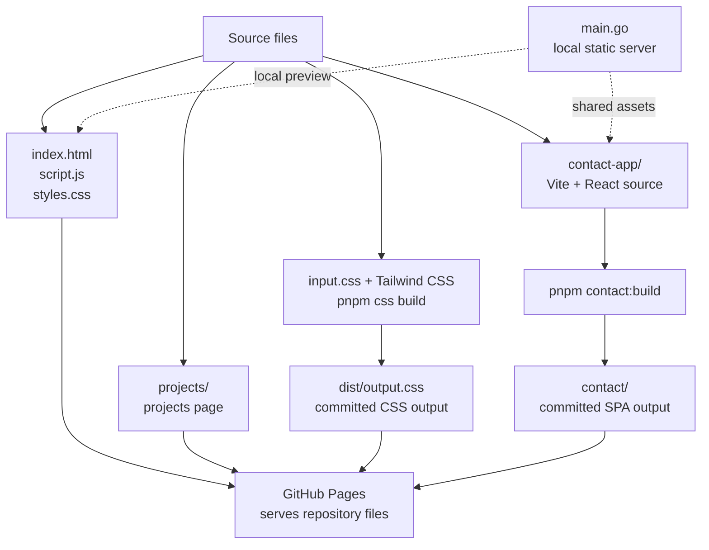

# Welcome to daruks.com! 
このページはだるかすのただの[ホームページ](https://daruks.com/)です 
多分知識がなさ過ぎてろくなもの作れませんゆるしてくださいなんでもしｍ

# Build Stacks!

## Website

| Technology | Purpose |
| --- | --- |
| Static HTML / CSS / JavaScript | Main website pages |
| Hand-written CSS | Shared site styling and page-specific effects |
| Tailwind CSS v4 | Utility CSS compiled into `dist/output.css` |
| Vite + React | Contact page SPA source in `contact-app/` |
| Go local static server | Local development server |
| pnpm workspace | Dependency and workspace management |
| GitHub Pages | Static hosting from committed files |

## Project Structure Diagram

